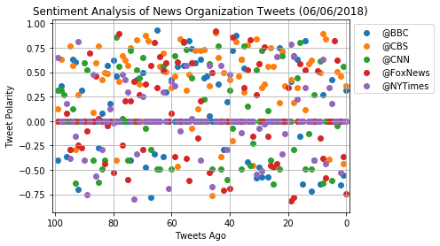
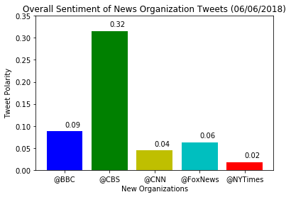

Observable Trends:
    1) Majority of the last 100 tweets sent out by each news organization were positive sentiments.
    2) Majority of the positive sentiments sent out were in the last 50-80 tweets.
    3) @CBS has the highest average positive sentiment tweets, and @NYTimes has the lowest average positive sentiment tweets.  


```python
#Dependencies.

import tweepy
import json
import pandas as pd
import numpy as np
import time
from datetime import datetime
import matplotlib.pyplot as plt
import seaborn as sns
```


```python
# Import and Initialize Sentiment Analyzer
from vaderSentiment.vaderSentiment import SentimentIntensityAnalyzer
analyzer = SentimentIntensityAnalyzer()
```


```python
# Twitter API Keys
from config import (consumer_key, 
                    consumer_secret, 
                    access_token, 
                    access_token_secret)
```


```python
# Setup Tweepy API Authentication
auth = tweepy.OAuthHandler(consumer_key, consumer_secret)
auth.set_access_token(access_token, access_token_secret)
api = tweepy.API(auth, parser=tweepy.parsers.JSONParser())
```


```python
#Get tweets from each news organization's twitter feeds. Create a list of sentiments.

sentiments = []

target_users = ("@BBC", "@CBS", "@CNN", "@FoxNews", "@NYTimes")

# Loop though target users.

for user in target_users:
    
    # Counter for last 100 tweets by each user

    counter = 0
    
    # Loop through 5 pages of tweets for each user (limit 200 per page)


    # Get all tweets for each user 

    public_tweets = api.user_timeline(user, count = 100)

        # Loop through all tweets.

    for tweet in public_tweets:

        # Run the Vader analysis on each tweet.

        compound = analyzer.polarity_scores(tweet["text"])["compound"]
        pos = analyzer.polarity_scores(tweet["text"])["pos"]
        neu = analyzer.polarity_scores(tweet["text"])["neu"]
        neg = analyzer.polarity_scores(tweet["text"])["neg"]
        tweets_ago = counter
        tweet_text = tweet["text"]

        # Add sentiments for each tweet to the sentiments list.

        sentiments.append({"User" : user,
                           "Date": tweet["created_at"],
                           "Compound" : compound,
                           "Positive" : pos,
                           "Negative" : neg,
                           "Neutral" : neu,
                           "Tweets Ago" : counter,
                           "Tweet Text" : tweet_text})
        # Add to counter.

        counter = counter + 1

```


```python
# Create DataFrame

user_sentiments = pd.DataFrame.from_dict(sentiments)
user_sentiments

# Score of 0 expresses a neutral sentiment, -1 the most negative sentiment possible, and +1 the most positive sentiment possible
```


<div>
<style scoped>
    .dataframe tbody tr th:only-of-type {
        vertical-align: middle;
    }

    .dataframe tbody tr th {
        vertical-align: top;
    }

    .dataframe thead th {
        text-align: right;
    }
</style>
<table border="1" class="dataframe">
  <thead>
    <tr style="text-align: right;">
      <th></th>
      <th>Compound</th>
      <th>Date</th>
      <th>Negative</th>
      <th>Neutral</th>
      <th>Positive</th>
      <th>Tweet Text</th>
      <th>Tweets Ago</th>
      <th>User</th>
    </tr>
  </thead>
  <tbody>
    <tr>
      <th>0</th>
      <td>0.3182</td>
      <td>Wed Jun 06 13:02:05 +0000 2018</td>
      <td>0.000</td>
      <td>0.892</td>
      <td>0.108</td>
      <td>From a French novel about the Burundi genocide...</td>
      <td>0</td>
      <td>@BBC</td>
    </tr>
    <tr>
      <th>1</th>
      <td>-0.5574</td>
      <td>Wed Jun 06 12:21:20 +0000 2018</td>
      <td>0.153</td>
      <td>0.847</td>
      <td>0.000</td>
      <td>RT @BBC_ARoadshow: Fiona discovers more about ...</td>
      <td>1</td>
      <td>@BBC</td>
    </tr>
    <tr>
      <th>2</th>
      <td>-0.6523</td>
      <td>Wed Jun 06 12:03:06 +0000 2018</td>
      <td>0.236</td>
      <td>0.764</td>
      <td>0.000</td>
      <td>Ethan Hawke relives the time when one of his c...</td>
      <td>2</td>
      <td>@BBC</td>
    </tr>
    <tr>
      <th>3</th>
      <td>0.0000</td>
      <td>Wed Jun 06 11:02:02 +0000 2018</td>
      <td>0.000</td>
      <td>1.000</td>
      <td>0.000</td>
      <td>In 1993, Steven Spielberg's film Jurassic Park...</td>
      <td>3</td>
      <td>@BBC</td>
    </tr>
    <tr>
      <th>4</th>
      <td>0.0000</td>
      <td>Wed Jun 06 10:01:40 +0000 2018</td>
      <td>0.000</td>
      <td>1.000</td>
      <td>0.000</td>
      <td>RT @BBCSpringwatch: Ever heard a beatboxing st...</td>
      <td>4</td>
      <td>@BBC</td>
    </tr>
    <tr>
      <th>5</th>
      <td>0.4215</td>
      <td>Wed Jun 06 08:55:39 +0000 2018</td>
      <td>0.000</td>
      <td>0.833</td>
      <td>0.167</td>
      <td>RT @bbcthree: Madame Poole has been ballet dan...</td>
      <td>5</td>
      <td>@BBC</td>
    </tr>
    <tr>
      <th>6</th>
      <td>0.0000</td>
      <td>Wed Jun 06 08:55:13 +0000 2018</td>
      <td>0.000</td>
      <td>1.000</td>
      <td>0.000</td>
      <td>RT @BBCTwo: What if @BBCSpringwatch did #LoveI...</td>
      <td>6</td>
      <td>@BBC</td>
    </tr>
    <tr>
      <th>7</th>
      <td>0.0000</td>
      <td>Wed Jun 06 08:55:07 +0000 2018</td>
      <td>0.000</td>
      <td>1.000</td>
      <td>0.000</td>
      <td>RT @BBCFOUR: Here's a sneak preview of our bra...</td>
      <td>7</td>
      <td>@BBC</td>
    </tr>
    <tr>
      <th>8</th>
      <td>0.2732</td>
      <td>Wed Jun 06 08:02:01 +0000 2018</td>
      <td>0.126</td>
      <td>0.698</td>
      <td>0.177</td>
      <td>When Mona began to lose her sight, her 84-year...</td>
      <td>8</td>
      <td>@BBC</td>
    </tr>
    <tr>
      <th>9</th>
      <td>-0.6486</td>
      <td>Wed Jun 06 07:31:01 +0000 2018</td>
      <td>0.229</td>
      <td>0.711</td>
      <td>0.059</td>
      <td>We're all familiar with that sinking, nagging ...</td>
      <td>9</td>
      <td>@BBC</td>
    </tr>
    <tr>
      <th>10</th>
      <td>0.0000</td>
      <td>Wed Jun 06 07:04:04 +0000 2018</td>
      <td>0.000</td>
      <td>1.000</td>
      <td>0.000</td>
      <td>📻🐫🦅🐼🦈 @GregJames has got a new co-host!\n\nSir...</td>
      <td>10</td>
      <td>@BBC</td>
    </tr>
    <tr>
      <th>11</th>
      <td>-0.4019</td>
      <td>Tue Jun 05 19:25:03 +0000 2018</td>
      <td>0.137</td>
      <td>0.863</td>
      <td>0.000</td>
      <td>'The problem with plastic is that it never goe...</td>
      <td>11</td>
      <td>@BBC</td>
    </tr>
    <tr>
      <th>12</th>
      <td>-0.7184</td>
      <td>Tue Jun 05 19:02:05 +0000 2018</td>
      <td>0.273</td>
      <td>0.727</td>
      <td>0.000</td>
      <td>#OurGirl is back and heading to Nigeria in the...</td>
      <td>12</td>
      <td>@BBC</td>
    </tr>
    <tr>
      <th>13</th>
      <td>0.0000</td>
      <td>Tue Jun 05 18:02:06 +0000 2018</td>
      <td>0.000</td>
      <td>1.000</td>
      <td>0.000</td>
      <td>👶🥦 If your child's a fussy eater, here are 5 t...</td>
      <td>13</td>
      <td>@BBC</td>
    </tr>
    <tr>
      <th>14</th>
      <td>0.8221</td>
      <td>Tue Jun 05 16:50:46 +0000 2018</td>
      <td>0.000</td>
      <td>0.719</td>
      <td>0.281</td>
      <td>RT @BBCTwo: Always wanted to pitch an idea to ...</td>
      <td>14</td>
      <td>@BBC</td>
    </tr>
    <tr>
      <th>15</th>
      <td>-0.6486</td>
      <td>Tue Jun 05 16:31:52 +0000 2018</td>
      <td>0.223</td>
      <td>0.777</td>
      <td>0.000</td>
      <td>💔 Fashion designer Kate Spade, 55, has been fo...</td>
      <td>15</td>
      <td>@BBC</td>
    </tr>
    <tr>
      <th>16</th>
      <td>-0.1531</td>
      <td>Tue Jun 05 16:00:22 +0000 2018</td>
      <td>0.110</td>
      <td>0.814</td>
      <td>0.076</td>
      <td>♻️🗑 These protesters want shops to take more r...</td>
      <td>16</td>
      <td>@BBC</td>
    </tr>
    <tr>
      <th>17</th>
      <td>0.6369</td>
      <td>Tue Jun 05 13:01:07 +0000 2018</td>
      <td>0.000</td>
      <td>0.840</td>
      <td>0.160</td>
      <td>❤️😽 This man has vowed to be the best 'cat dad...</td>
      <td>17</td>
      <td>@BBC</td>
    </tr>
    <tr>
      <th>18</th>
      <td>0.6696</td>
      <td>Tue Jun 05 12:00:22 +0000 2018</td>
      <td>0.000</td>
      <td>0.640</td>
      <td>0.360</td>
      <td>😂 These knitted Poldark dolls are the best!\n#...</td>
      <td>18</td>
      <td>@BBC</td>
    </tr>
    <tr>
      <th>19</th>
      <td>0.4019</td>
      <td>Tue Jun 05 11:12:05 +0000 2018</td>
      <td>0.000</td>
      <td>0.863</td>
      <td>0.137</td>
      <td>RT @BBC_ARoadshow: From artists to explorers, ...</td>
      <td>19</td>
      <td>@BBC</td>
    </tr>
    <tr>
      <th>20</th>
      <td>0.0000</td>
      <td>Tue Jun 05 11:00:07 +0000 2018</td>
      <td>0.000</td>
      <td>1.000</td>
      <td>0.000</td>
      <td>How does plastic actually enter our oceans? \n...</td>
      <td>20</td>
      <td>@BBC</td>
    </tr>
    <tr>
      <th>21</th>
      <td>0.0000</td>
      <td>Tue Jun 05 10:45:52 +0000 2018</td>
      <td>0.000</td>
      <td>1.000</td>
      <td>0.000</td>
      <td>RT @BBCBreakfast: Have you got yours yet? #gin...</td>
      <td>21</td>
      <td>@BBC</td>
    </tr>
    <tr>
      <th>22</th>
      <td>0.7096</td>
      <td>Tue Jun 05 10:34:07 +0000 2018</td>
      <td>0.000</td>
      <td>0.763</td>
      <td>0.237</td>
      <td>RT @bbcthree: 17-year-old Dillon upcycles clot...</td>
      <td>22</td>
      <td>@BBC</td>
    </tr>
    <tr>
      <th>23</th>
      <td>0.7506</td>
      <td>Tue Jun 05 10:31:20 +0000 2018</td>
      <td>0.000</td>
      <td>0.758</td>
      <td>0.242</td>
      <td>RT @BBCNews: "I was disabled before it was pop...</td>
      <td>23</td>
      <td>@BBC</td>
    </tr>
    <tr>
      <th>24</th>
      <td>0.0000</td>
      <td>Tue Jun 05 10:21:33 +0000 2018</td>
      <td>0.000</td>
      <td>1.000</td>
      <td>0.000</td>
      <td>🎨🙌 Middle-earth in colour: How Tolkien drew hi...</td>
      <td>24</td>
      <td>@BBC</td>
    </tr>
    <tr>
      <th>25</th>
      <td>0.0000</td>
      <td>Tue Jun 05 09:34:23 +0000 2018</td>
      <td>0.000</td>
      <td>1.000</td>
      <td>0.000</td>
      <td>It's time to think about our plastic behaviour...</td>
      <td>25</td>
      <td>@BBC</td>
    </tr>
    <tr>
      <th>26</th>
      <td>0.0000</td>
      <td>Tue Jun 05 08:01:03 +0000 2018</td>
      <td>0.000</td>
      <td>1.000</td>
      <td>0.000</td>
      <td>Some of Arthur C Clarke's predictions about th...</td>
      <td>26</td>
      <td>@BBC</td>
    </tr>
    <tr>
      <th>27</th>
      <td>-0.5719</td>
      <td>Tue Jun 05 07:29:04 +0000 2018</td>
      <td>0.346</td>
      <td>0.654</td>
      <td>0.000</td>
      <td>📎 The psychology of stealing office supplies. ...</td>
      <td>27</td>
      <td>@BBC</td>
    </tr>
    <tr>
      <th>28</th>
      <td>0.0000</td>
      <td>Tue Jun 05 07:00:11 +0000 2018</td>
      <td>0.000</td>
      <td>1.000</td>
      <td>0.000</td>
      <td>💤 Ever wondered what your brain is up to while...</td>
      <td>28</td>
      <td>@BBC</td>
    </tr>
    <tr>
      <th>29</th>
      <td>-0.5707</td>
      <td>Mon Jun 04 19:03:02 +0000 2018</td>
      <td>0.178</td>
      <td>0.822</td>
      <td>0.000</td>
      <td>Versailles is back! Tonight, Madame de Montesp...</td>
      <td>29</td>
      <td>@BBC</td>
    </tr>
    <tr>
      <th>...</th>
      <td>...</td>
      <td>...</td>
      <td>...</td>
      <td>...</td>
      <td>...</td>
      <td>...</td>
      <td>...</td>
      <td>...</td>
    </tr>
    <tr>
      <th>470</th>
      <td>0.2500</td>
      <td>Wed Jun 06 00:47:05 +0000 2018</td>
      <td>0.000</td>
      <td>0.917</td>
      <td>0.083</td>
      <td>Much of what makes New York unique was created...</td>
      <td>70</td>
      <td>@NYTimes</td>
    </tr>
    <tr>
      <th>471</th>
      <td>0.0000</td>
      <td>Wed Jun 06 00:37:05 +0000 2018</td>
      <td>0.000</td>
      <td>1.000</td>
      <td>0.000</td>
      <td>8 states have primary elections today. Here's ...</td>
      <td>71</td>
      <td>@NYTimes</td>
    </tr>
    <tr>
      <th>472</th>
      <td>-0.3400</td>
      <td>Wed Jun 06 00:27:05 +0000 2018</td>
      <td>0.142</td>
      <td>0.780</td>
      <td>0.078</td>
      <td>Who will likely be blamed if Democrats get loc...</td>
      <td>72</td>
      <td>@NYTimes</td>
    </tr>
    <tr>
      <th>473</th>
      <td>-0.7964</td>
      <td>Wed Jun 06 00:17:03 +0000 2018</td>
      <td>0.272</td>
      <td>0.728</td>
      <td>0.000</td>
      <td>RT @nytpolitics: The assassination fueled a ge...</td>
      <td>73</td>
      <td>@NYTimes</td>
    </tr>
    <tr>
      <th>474</th>
      <td>0.0000</td>
      <td>Wed Jun 06 00:02:05 +0000 2018</td>
      <td>0.000</td>
      <td>1.000</td>
      <td>0.000</td>
      <td>8 states voted in one of the busiest days of p...</td>
      <td>74</td>
      <td>@NYTimes</td>
    </tr>
    <tr>
      <th>475</th>
      <td>0.2960</td>
      <td>Tue Jun 05 23:47:03 +0000 2018</td>
      <td>0.000</td>
      <td>0.891</td>
      <td>0.109</td>
      <td>Scott Pruitt gave a political aide the task of...</td>
      <td>75</td>
      <td>@NYTimes</td>
    </tr>
    <tr>
      <th>476</th>
      <td>0.4215</td>
      <td>Tue Jun 05 23:32:07 +0000 2018</td>
      <td>0.000</td>
      <td>0.872</td>
      <td>0.128</td>
      <td>Betsy DeVos said the federal commission on sch...</td>
      <td>76</td>
      <td>@NYTimes</td>
    </tr>
    <tr>
      <th>477</th>
      <td>0.4767</td>
      <td>Tue Jun 05 23:21:03 +0000 2018</td>
      <td>0.000</td>
      <td>0.860</td>
      <td>0.140</td>
      <td>RT @gabrieldance: New: Facebook gave private d...</td>
      <td>77</td>
      <td>@NYTimes</td>
    </tr>
    <tr>
      <th>478</th>
      <td>0.0000</td>
      <td>Tue Jun 05 23:11:30 +0000 2018</td>
      <td>0.000</td>
      <td>1.000</td>
      <td>0.000</td>
      <td>Breaking News: Facebook has given at least fou...</td>
      <td>78</td>
      <td>@NYTimes</td>
    </tr>
    <tr>
      <th>479</th>
      <td>0.0000</td>
      <td>Tue Jun 05 23:02:03 +0000 2018</td>
      <td>0.000</td>
      <td>1.000</td>
      <td>0.000</td>
      <td>Evening Briefing: Here's what you need to know...</td>
      <td>79</td>
      <td>@NYTimes</td>
    </tr>
    <tr>
      <th>480</th>
      <td>-0.0227</td>
      <td>Tue Jun 05 22:51:03 +0000 2018</td>
      <td>0.083</td>
      <td>0.837</td>
      <td>0.079</td>
      <td>RT @arappeport: In a letter to Congress, Trump...</td>
      <td>80</td>
      <td>@NYTimes</td>
    </tr>
    <tr>
      <th>481</th>
      <td>0.1280</td>
      <td>Tue Jun 05 22:41:04 +0000 2018</td>
      <td>0.100</td>
      <td>0.779</td>
      <td>0.121</td>
      <td>Kate Spade was a critical figure in the contin...</td>
      <td>81</td>
      <td>@NYTimes</td>
    </tr>
    <tr>
      <th>482</th>
      <td>0.0000</td>
      <td>Tue Jun 05 22:27:05 +0000 2018</td>
      <td>0.000</td>
      <td>1.000</td>
      <td>0.000</td>
      <td>8 states are holding primaries today. Here's w...</td>
      <td>82</td>
      <td>@NYTimes</td>
    </tr>
    <tr>
      <th>483</th>
      <td>0.0000</td>
      <td>Tue Jun 05 22:12:02 +0000 2018</td>
      <td>0.000</td>
      <td>1.000</td>
      <td>0.000</td>
      <td>RT @NYTNational: ⚡️ “On the Ground at the Cali...</td>
      <td>83</td>
      <td>@NYTimes</td>
    </tr>
    <tr>
      <th>484</th>
      <td>-0.2960</td>
      <td>Tue Jun 05 21:58:03 +0000 2018</td>
      <td>0.095</td>
      <td>0.905</td>
      <td>0.000</td>
      <td>Breaking News: Mexico hit back at the U.S., sa...</td>
      <td>84</td>
      <td>@NYTimes</td>
    </tr>
    <tr>
      <th>485</th>
      <td>0.0000</td>
      <td>Tue Jun 05 21:46:06 +0000 2018</td>
      <td>0.000</td>
      <td>1.000</td>
      <td>0.000</td>
      <td>How much tourism is too much? On the Galápagos...</td>
      <td>85</td>
      <td>@NYTimes</td>
    </tr>
    <tr>
      <th>486</th>
      <td>-0.5610</td>
      <td>Tue Jun 05 21:27:05 +0000 2018</td>
      <td>0.195</td>
      <td>0.805</td>
      <td>0.000</td>
      <td>RT @VVFriedman: On this sad day, thoughts on K...</td>
      <td>86</td>
      <td>@NYTimes</td>
    </tr>
    <tr>
      <th>487</th>
      <td>0.4767</td>
      <td>Tue Jun 05 21:12:02 +0000 2018</td>
      <td>0.000</td>
      <td>0.830</td>
      <td>0.170</td>
      <td>Jordan Peele, who wrote and directed "Get Out,...</td>
      <td>87</td>
      <td>@NYTimes</td>
    </tr>
    <tr>
      <th>488</th>
      <td>0.0000</td>
      <td>Tue Jun 05 21:03:46 +0000 2018</td>
      <td>0.000</td>
      <td>1.000</td>
      <td>0.000</td>
      <td>California's 10th congressional district is on...</td>
      <td>88</td>
      <td>@NYTimes</td>
    </tr>
    <tr>
      <th>489</th>
      <td>-0.7579</td>
      <td>Tue Jun 05 21:03:05 +0000 2018</td>
      <td>0.265</td>
      <td>0.735</td>
      <td>0.000</td>
      <td>After a teenager was fatally shot by a police ...</td>
      <td>89</td>
      <td>@NYTimes</td>
    </tr>
    <tr>
      <th>490</th>
      <td>-0.4019</td>
      <td>Tue Jun 05 20:55:04 +0000 2018</td>
      <td>0.173</td>
      <td>0.723</td>
      <td>0.104</td>
      <td>Kate Spade, who was found dead on Tuesday, had...</td>
      <td>90</td>
      <td>@NYTimes</td>
    </tr>
    <tr>
      <th>491</th>
      <td>0.0000</td>
      <td>Tue Jun 05 20:40:03 +0000 2018</td>
      <td>0.000</td>
      <td>1.000</td>
      <td>0.000</td>
      <td>Rep. Tulsi Gabbard wants visitors to stay away...</td>
      <td>91</td>
      <td>@NYTimes</td>
    </tr>
    <tr>
      <th>492</th>
      <td>0.8126</td>
      <td>Tue Jun 05 20:33:45 +0000 2018</td>
      <td>0.000</td>
      <td>0.720</td>
      <td>0.280</td>
      <td>RT @mccanner: I love this. New York Times phot...</td>
      <td>92</td>
      <td>@NYTimes</td>
    </tr>
    <tr>
      <th>493</th>
      <td>-0.1531</td>
      <td>Tue Jun 05 20:25:03 +0000 2018</td>
      <td>0.082</td>
      <td>0.918</td>
      <td>0.000</td>
      <td>“We are not going to judge you on your outward...</td>
      <td>93</td>
      <td>@NYTimes</td>
    </tr>
    <tr>
      <th>494</th>
      <td>0.0000</td>
      <td>Tue Jun 05 20:10:09 +0000 2018</td>
      <td>0.000</td>
      <td>1.000</td>
      <td>0.000</td>
      <td>A school wanted to prepare its eighth-graders ...</td>
      <td>94</td>
      <td>@NYTimes</td>
    </tr>
    <tr>
      <th>495</th>
      <td>-0.3818</td>
      <td>Tue Jun 05 19:57:02 +0000 2018</td>
      <td>0.167</td>
      <td>0.833</td>
      <td>0.000</td>
      <td>Crowdfunding campaigns are designed for just a...</td>
      <td>95</td>
      <td>@NYTimes</td>
    </tr>
    <tr>
      <th>496</th>
      <td>0.1779</td>
      <td>Tue Jun 05 19:47:04 +0000 2018</td>
      <td>0.064</td>
      <td>0.843</td>
      <td>0.092</td>
      <td>RT @nytpolitics: News Analysis: The president’...</td>
      <td>96</td>
      <td>@NYTimes</td>
    </tr>
    <tr>
      <th>497</th>
      <td>0.0000</td>
      <td>Tue Jun 05 19:37:04 +0000 2018</td>
      <td>0.000</td>
      <td>1.000</td>
      <td>0.000</td>
      <td>A court has ordered Mexico's government to aga...</td>
      <td>97</td>
      <td>@NYTimes</td>
    </tr>
    <tr>
      <th>498</th>
      <td>0.0000</td>
      <td>Tue Jun 05 19:31:08 +0000 2018</td>
      <td>0.000</td>
      <td>1.000</td>
      <td>0.000</td>
      <td>RT @jdelreal: I may have just visited the cool...</td>
      <td>98</td>
      <td>@NYTimes</td>
    </tr>
    <tr>
      <th>499</th>
      <td>0.6486</td>
      <td>Tue Jun 05 19:27:03 +0000 2018</td>
      <td>0.000</td>
      <td>0.751</td>
      <td>0.249</td>
      <td>The California primary might give us a better ...</td>
      <td>99</td>
      <td>@NYTimes</td>
    </tr>
  </tbody>
</table>
<p>500 rows × 8 columns</p>
</div>


```python
# Export the DataFrame to as csv.

user_sentiments.to_csv("Twitter_Sentiment_Analysis_News.csv", index=False)
```


```python
# Plot scatterplot graph.

# Set the x limit,
plt.xlim(101, -1)

# Plot scatterplot using a for loop.
for user in target_users:
    dataframe = user_sentiments.loc[user_sentiments["User"] == user]
    plt.scatter(dataframe["Tweets Ago"],dataframe["Compound"],label = user)
    
#Add legend
plt.legend(bbox_to_anchor = (1,1))

#Add title, x axis label, and y axis label.
plt.title("Sentiment Analysis of News Organization Tweets (06/06/2018)")
plt.xlabel("Tweets Ago")
plt.ylabel("Tweet Polarity")

#Set a grid on the plot.
plt.grid()

plt.savefig("Sentiment Analysis of News Organization Tweets")
plt.show()
```





```python
average_sentiment = user_sentiments.groupby("User")["Compound"].mean()
average_sentiment
```


    User
    @BBC        0.088389
    @CBS        0.315567
    @CNN        0.044625
    @FoxNews    0.063224
    @NYTimes    0.018087
    Name: Compound, dtype: float64


```python
x_axis = np.arange(len(average_sentiment))
xlabels = average_sentiment.index
count = 0
for sentiment in average_sentiment:
    plt.text(count, sentiment+.01, str(round(sentiment,2)))
    count = count + 1
plt.bar(x_axis, average_sentiment, tick_label = xlabels, color = ['b', 'g', 'y', 'c', 'r'])
plt.ylim(ymax=.35)

#Set title, x axis label, and y axis label.
plt.title("Overall Sentiment of News Organization Tweets (06/06/2018)")
plt.xlabel("New Organizations")
plt.ylabel("Tweet Polarity")
plt.savefig("Overall Sentiment of News Organization Tweets")
plt.show()
```




